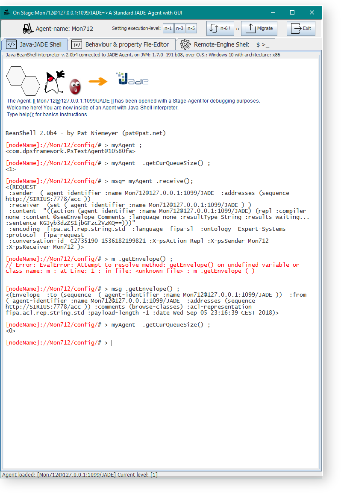
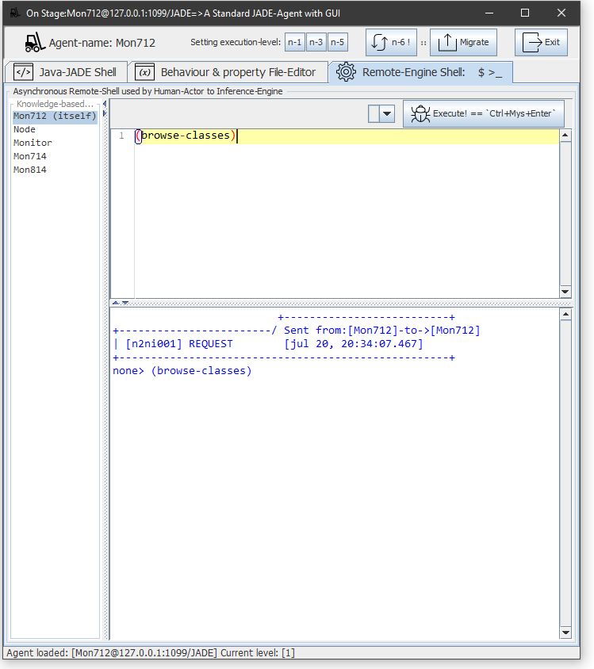
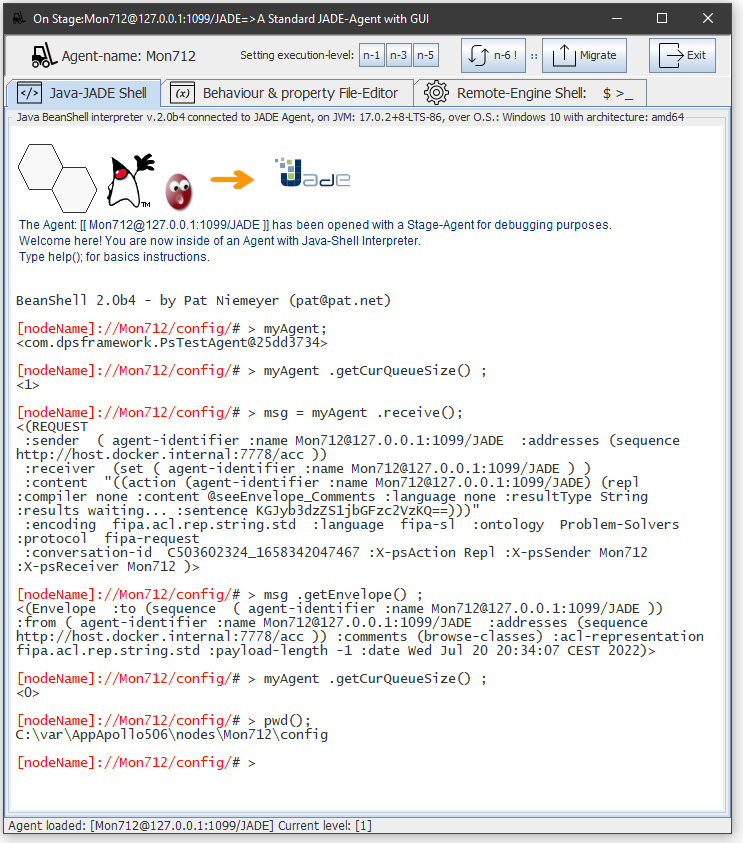

# PS-Agents-1.8 installer utility 

- The previous version of PS-Agents can still be obtained by downloading \[dpsFrameworkBuilder-full-1.8.jar\](https://github.com/dpsframework/PS-Agents-1.8/releases/download/1.8/dpsFrameworkBuilder-full-1.8.jar) from GitHub at that address.
- To create an agent-oriented application that also uses PS-Agents type agents and that is deployed on the JADE Platform, it is first necessary to create the environment with the dpsFramework-Builder installation utility. These are the four steps to follow:


### 1. Where to download it from

The PS-Agents-1.8 version installer is still available at: https://github.com/dpsframework/PS-Agents-1.8/releases/tag/1.8

- Please download version 1.8 of the installer `dpsFrameworkBuilder-full-1.8.jar` to your local hard drive.


### 2. Set the environment variable

- From a terminal, from the directory where you have downloaded the installer, configure the CLASSPATH variable for correct operation.
- NOTE: `dpsFrameworkBuilder-full-1.8.jar file`is 24.099.219 bytes in size. 


```powershell
:: Windows only:
---------------------
   > java -version
   > set CLASSPATH=./*;lib/*;


:: GNU-Linux or OS-X:
---------------------
   $ java -version
   $ export CLASSPATH=./*:lib/*:
   


:: Test it with:
---------------------
   $ java -jar dpsFrameworkBuilder-full-1.8.jar

```   


- You should then get console output like the following. 


```powershell
_______________________________________________________________________
 Node Board Monitor Stage-Node   Project: DPS-framework
 ---- ----- ------- ----------   JADE Agents to distribute RBES Apps
   O    ||             __        ______________________________________
  O     ||      O     /  \      /
  O     ||     O      \__/     /
______________________________/

 Usage: java framework [option]

 Options : [new |--new=]   Name      # dpsFramework directory.
           [-h  |--help]             # Help or verbose help

           [-n  |--no-doc]           # Don't install Javadoc.
           [-l  |--no-lib]           # Don't install Libraries.

 Examples: java framework  new  set51
           java framework  -h

 version:  full-1.8 RF.1921
____________
            \______________________________________________________

```

- If so, everything is correct. 
- **IMPORTANT**: Please, do not forget that this version of `PS-Agents-1.8` is only operative on Java SE-9 and Java SE-8.
- Higher versions of Java SE block access to the Rules-Engine.


### 3. How to use the installer

- First things first: create the agent application directory.
    - We propose to create an agent application with a name equal to: `AppApollo506` 
    
- REMEMBER: that all instances of `AppApollo506` application deployed on remote servers with will allow their `PS-Agents`type agents, to connect and exchange rules and knowledge.  
- Please name your new application whatever you like.


```powershell
  
 $ >  java -jar dpsFrameworkBuilder-full-1.8.jar new AppApollo506 --no-doc
 
 
```
- We have used the `--no-doc` parameter. It is no longer necessary to install a copy of all the documentation in each Application Directory. 
- Documentation is available at https://dpsframework.org/archives/
- The console output will be something like: 

```powershell
-----------------------------------------------------------------------
 Node Board Monitor Stage-Node   Project: DPS-framework
 ---- ----- ------- ----------   JADE Agents to distribute RBES Apps
   O    ||             __        ______________________________________
  O     ||      O     /  \      /
  O     ||     O      \__/     /
______________________________/

  New dpsFramework directory: [AppApollo506], is making.
  create  AppApollo506
  create  AppApollo506\nodes\Node\var
  create  AppApollo506\nodes\Node\engine
  create  AppApollo506\nodes\Node\engine\logs
  create  AppApollo506\nodes\Node\config
  create  AppApollo506\nodes\Monitor\var
  create  AppApollo506\nodes\Monitor\config
  create  AppApollo506\nodes\Board\var
  create  AppApollo506\nodes\Board\config
  create  AppApollo506\logs
  create  AppApollo506\config
  create  AppApollo506\lib
  create  AppApollo506\lib\w64
  create  AppApollo506\lib\w32
  create  AppApollo506\lib\ux64
  create  AppApollo506\lib\ux32
  create  AppApollo506\lib\mac
  create  AppApollo506\lib\jena
  create  AppApollo506\lib\arm
  create  AppApollo506\lib\Licenses

  Framework: [ AppApollo506 ] has been created with structure:
               |
               +
               +---config/
               +---lib/
               |     +-------w64/
               +---logs/
               |
               +---nodes/
                      +-------(PsNode names)/
                      |                   +---config/
                      |                   +---engine/
                      |                   +---var/

  Note before running:
       On Windows family                : set    CLASSPATH=lib/*;
       On Linux or OS-X                 : export CLASSPATH=lib/*:

  To access and deploy Agents on this Framework, please follow this steps:

       $ home/> cd AppApollo506
       $ home/AppApollo506/> java generate
       $ home/AppApollo506/> java launcher        
       $ home/AppApollo506/> java shell

____________
            \______________________________________________________
 

```

- This verifies that the application environment has been created correctly.


### 4. Operate on the application directory

- Now it is necessary to move to the directory, create some agent and launch JADE.

```powershell

 $ >  cd AppApollo506
 
 
 
 
 :: Test the environment of PS-Agents with:
 --------------------------------------------
 
 :~AppApollo506/ $ >  java shell
 :~AppApollo506/ $ >  java generate
 :~AppApollo506/ $ >  java launcher


```


- In this release of PS-Agents-1.8, the utility LAUNCHER can be used to create and launch agents in one step. 


```powershell

 :~AppApollo506/ $ >  java launcher monitor localhost Mon712

```
- This generates, in a single step, an agent named `Mon712`, of the `PSAgent-Monitor` type, intended to control and manage other agents belonging to the `AppApollo506` application. 
- When it has created the agent, it then launches the JADE Multi-Agent platform in stealth mode and the `Mon712` agent itself in the foreground.


**Fig. 1:** _Monitor-Agent GUI with selected Tab JADE-JAVA Shell console at run-time._


- For a rigorous control, you can do the following steps in a manual and controlled way with:


```powershell
:: Two agents are generated with names: Mon714 and Mon814
----------------------------------------------------------
 :~AppApollo506/ $ >  java generate --new=Mon714,Mon814 --type=monitor


:: A JADE instance is launched on localhost (on Windows):
--------------------------------------------------------
   >> start   java launcher platform localhost


:: A JADE instance is launched on localhost (on GNU-Linux - OS X):  
------------------------------------------------------------------
   $ java launcher platform localhost  &


:: LAUNCHER is used to launch the newly created agents:
------------------------------------------------------------------
   $ java launcher all-monitors localhost

```

- But the result will be the same. It will only be necessary to launch in the background so as not to lose control of the console.

### 4.bis Operate on the application directory with future PS-Agents

- Si ha creado los agentes de tipo PS-Agents en los apartados anteriores, también puede abrir un pequeño huevo de pascua que se encuentra en el Directorio de la Aplicación `AppApollo56`. Puede observar los tipos de agentes que es posible lanzar con LAUNCHER con la sentencia `cat`:

```powershell
  $ cat config/framework.properties
  
:: Output:
----------
#Revised at:
#Wed xxxx-xxxx--xxxx CEST 2022
ps.framework.publickey=asfjksd98843.9692adsf
ps.framework.app.author=Your name, over here.
ps.framework.keypasswd=password
ps.framework.app.title=Distributed Production-Systems on JADE Platform
ps.framework.node.serie=Node,Monitor,Mon712,Mon714,Mon814
ps.framework.app.nativelib=
ps.framework.app.created=Date
ps.framework.app.objective=You can simulate multiple lines with \\n symbol.
ps.launcher.artifacts.2=precog\:com.dpsframework.PsTestAgent
ps.framework.name=AppApollo506
ps.launcher.artifacts.1=test\:jade.tools.testagent.TestAgent
ps.launcher.artifacts.0=dummy\:jade.tools.DummyAgent.DummyAgent


```

- Bien, existe una forma de lanzar agentes tipo TEST, Dummy y PreCOG con la utilidad LAUNCHER.
- Los agentes de tipo PS-Agents-1.8 PsTestAgent, permiten emitir consultas en lenguaje JESS, Prolog o CLIPS hacia los agentes de la aplicación AppApollo506.
- Para conseguirlo, puede seguir esto pasos:

```powershell

  $ java launcher platform localhost  &
  $ java launcher precog   localhost   Mon712   &
  $ java launcher test     localhost   TestJADE101   &
  $ java launcher dummy    localhost   FamousDummy404  &
  
```

- Desde la pestaña Remote-Engine Shell $: del agente PreCog con nombre Mon712, emitir hacia sí mismo, una consulta del número de clases presentes en la memoria de trabajo de un hipotético agente conectado a un motor tipo CLIPS. Escriba por ejemplo: (browse-classes)  y presione, CTRL+ALT+Enter o presione el botón con la polilla.


**Fig. 2:** _PreCog-Agent GUI with selected Tab Remote-Engine Shell at run-time._



- A continuación, desde el la consola Shell del Intérprete de Java del agente, proceda con la secuencia de órdenes siguientes (véase: **Fig. 3**). Recuerde que tiene activada la función de ayuda de teclado y puede ir presionando la tecla TABULADOR, para recuperar las Funciones y Objetos del Framework JADE.

- Si desea construir y emitir mensajes hacia los otros agentes abiertos, es necesario elevar el nivel de ejecución del agente tipo [PS-Agents] hasta el nivel = 5. Presionando el botón en la barra superior o, si lo prefiere, con la llamada a función  `init( 5 );`desde la consola **Java-JADE Shell**.


**Fig. 3:** _PreCog-Agent GUI with selected Tab Remote-Engine Shell at run-time._



# 2. References 

[1]: **JADE Platform**. <http://jade.tilab.com/>. CSELT, S. & TILab, S. (2017). Jade - java agent development framework. is a framework to develop multi-agent systems in compliance with the fipa specifications. jade 4.5.0 - revision 6825 of 23-05-2017 10:06:04. Open Source, under LGPL restrictions.

[2]: **Agent Oriented Programming**. Shoham, Y. (2005). Agent oriented programming: An overview of the framework and summary of recent research. <https://link.springer.com/chapter/10.1007/3-540-58095-6_9>

[3]:  **FIPA**. [FIPA00001] FIPA Abstract Architecture Specification. Foundation for Intelligent Physical Agents, 2002. <http://www.fipa.org/specs/fipa00001>. 

